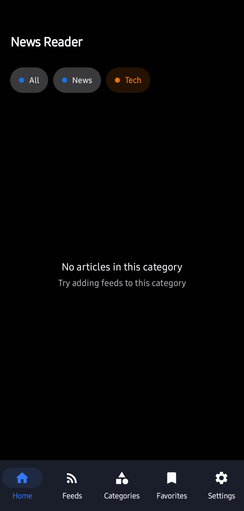
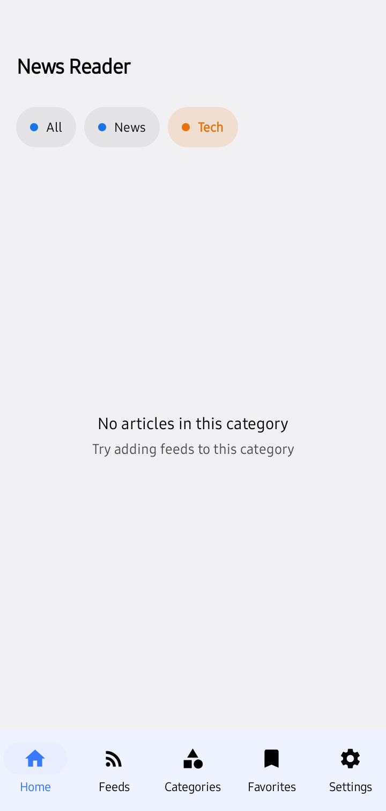
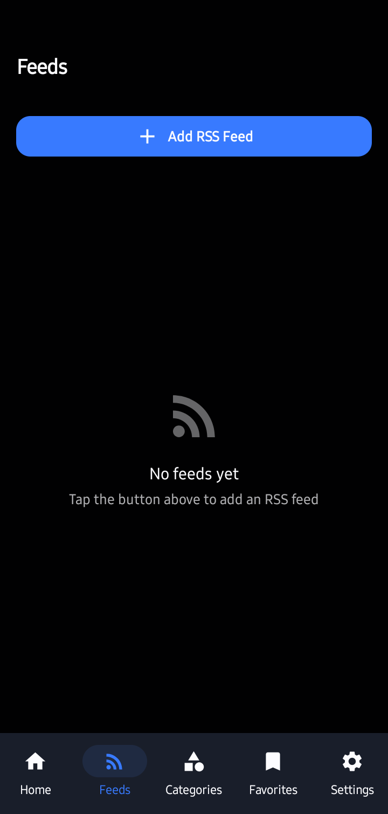
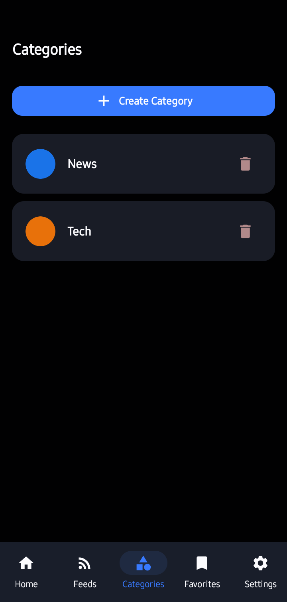
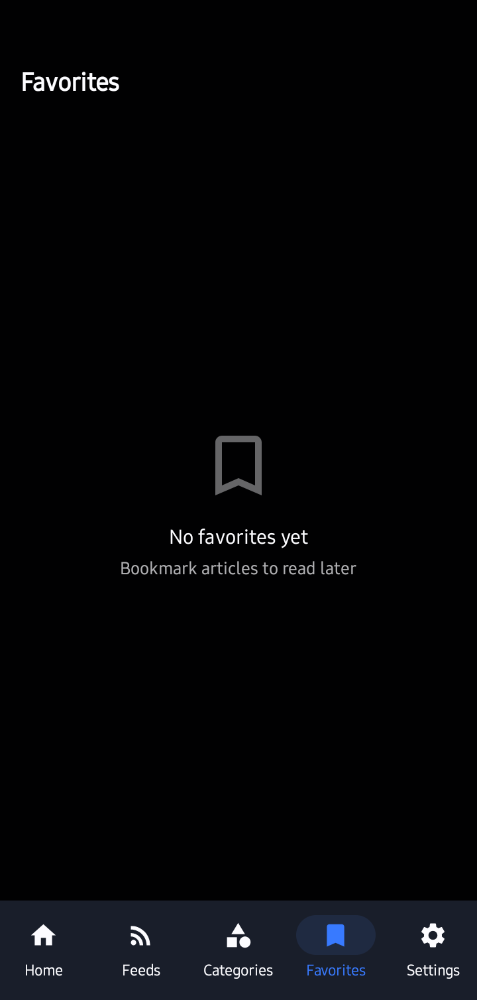
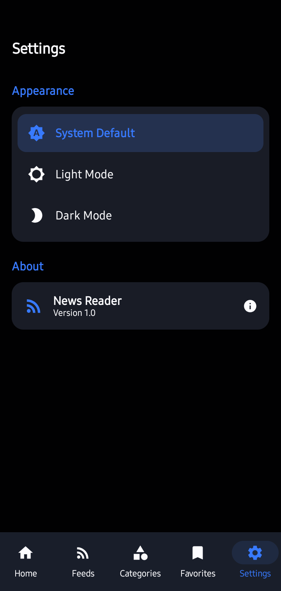

# News Reader

A modern, open-source Android RSS news reader built with Jetpack Compose and Material 3.

## Features

- **RSS Feed Management** — Add, remove, and refresh RSS feeds with one tap
- **Categories** — Organize feeds into custom categories
- **Favorites** — Bookmark articles to read later
- **Subscribe / Unsubscribe** — Temporarily disable feeds without removing them
- **Mark as Read** — Tracks read/unread status per article
- **Light / Dark / System theme** — Three-way toggle with dynamic color support (Android 12+)
- **Background sync** — Automatic feed refresh via WorkManager every 30 minutes
- **Error handling** — Animated toast notifications for errors and success messages
- **Article detail view** — Read articles in-app with share and open-in-browser options
- **iOS-inspired UI** — Clean, minimal design with native look and feel

## Tech Stack

| Layer | Technology |
|---|---|
| UI | Jetpack Compose + Material 3 |
| Architecture | MVVM with Flow + StateFlow |
| Database | Room (SQLite) |
| Networking | OkHttp |
| Background | WorkManager |
| Image loading | Coil |
| Navigation | Navigation Compose |
| Build | Gradle KTS + Version Catalog |

## Screenshots

Here is how the app looks:

<p align="center">
  
   
</p>
<p align="center">
  
   
   
   
</p>

## Getting Started

1. Open the project in **Android Studio** (Hedgehog or later)
2. Let Gradle sync complete
3. Run on an emulator or device running **Android 8.0+** (API 26)
4. Go to the **Feeds** tab and tap **Add RSS Feed**
5. Enter any RSS feed URL (e.g. `https://feeds.bbci.co.uk/news/rss.xml`)

## Building

```bash
./gradlew assembleDebug
```

## License

This project is licensed under the MIT License — see the [LICENSE](LICENSE) file for details.
